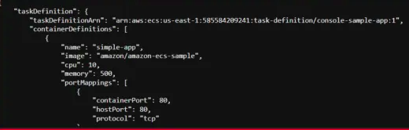
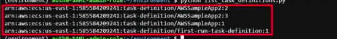

# DESCRIPTION

This template shows how to describe the task definition and List the task definition and task families using the Boto3.

---

#### Prerequiste

* Install Python
* AWS Configure

### Steps 

1. Open the folder in your terminal or any supported tool.
2. Run the following commands:

`describe-task-definition-boto3.py`

`list-task-definition-boto3.py`

`list-task-definition-families-boto3.py`

---

### Outputs  

<b>Describe Task Definition</b> 

<b>List Task Definition</b> 

<b>List Task Definition Families</b> 

---
